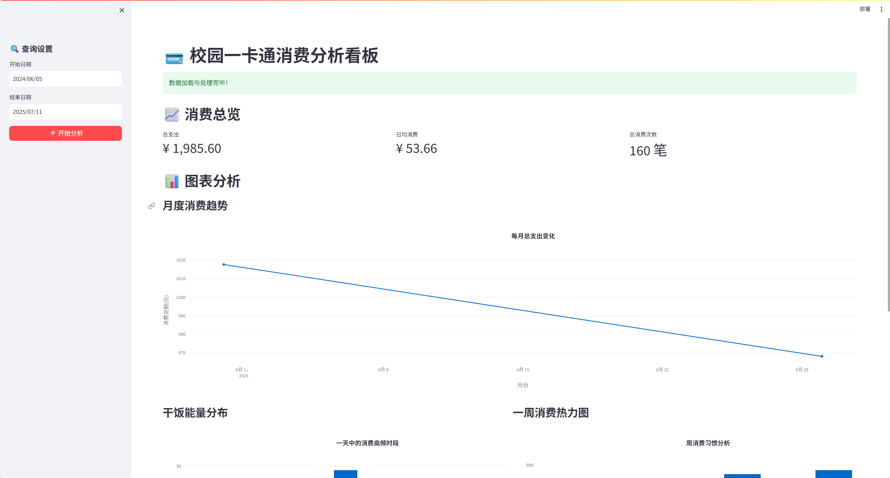
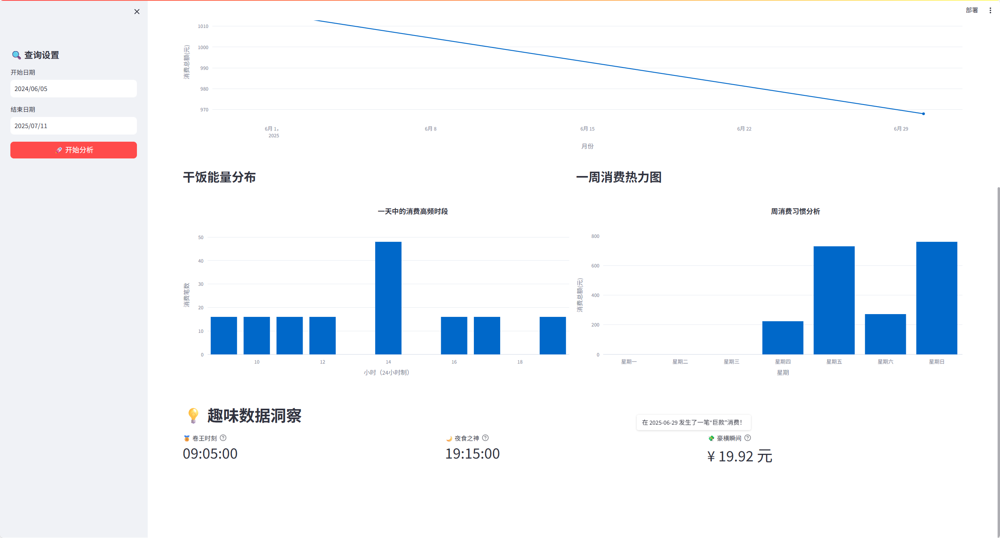
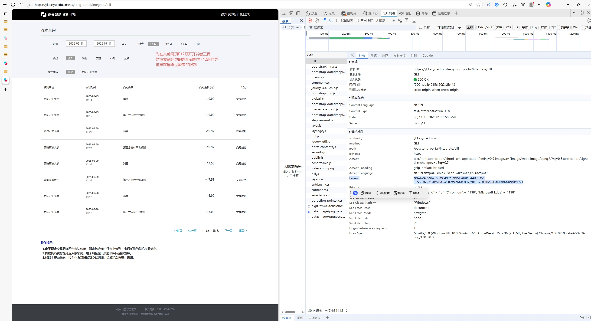

# 西安石油大学-校园一卡通年度账单


[](https://streamlit.io)


还在为每次查询校园卡消费记录的繁琐操作而烦恼吗？想知道一年下来，你的钱都花在了哪个食堂，哪家超市吗？

本项目是专为西安石油大学（XSYU）学子打造的一款校园一卡通年度账单分析工具。它能帮你告别手动翻页的痛苦，一键生成专属你的年度消费报告，并通过丰富有趣的图表，带你回顾一年来的校园“收支”点滴。

## ✨ 应用特色

-   **专属趣味分析**：新增 “趣味消费数据” 板块，为你揭秘你的 “卷王时刻”（最早消费时间）、“夜食之神”（最晚消费时间）以及 “豪横瞬间”（单笔最高消费），让数据分析不再枯燥。
-   **多维度可视化图表**：
    -   **月度消费趋势**：清晰展示每月支出变化，看清消费高峰。
    -   **消费时段分析**：通过每小时消费热力图，发现你的 “干饭” 高峰期。
    -   **周消费热力图**：直观了解一周内哪天花钱最多。
    -   **支出分类占比**：饼图展示各项消费类别的比例，帮你快速定位主要开销。
-   **可靠的认证方式**：通过使用您浏览器中已有的登录会话，完美绕过复杂的登录验证和反爬虫机制。
-   **现代化的 Web 界面**：基于 Streamlit 构建，提供美观、交互式的仪表盘，让您轻松进行数据分析。
-   **命令行兼容**：保留了传统的命令行模式，方便快速将原始账单导出为 `.xlsx` 文件。

## 📸 应用预览

**仪表盘总览**


**多维度图表分析 & 趣味数据洞察**



## 🚀 如何使用

### 1. 准备环境

首先，请确保您的电脑上已经安装了 Python。然后，在项目根目录下打开命令行工具（例如 PowerShell 或 CMD），运行以下命令来安装本项目所需的全部依赖库：

```bash
pip install -r requirements.txt
```

### 2. 获取并配置 Cookie (核心步骤)

Cookie 是您登录状态的身份凭证，程序需要用它来模拟您的登录状态以获取数据。

**⚠️ 特别注意**：目标网站包含**反调试机制**，直接在账单页面按 `F12` 可能会导致页面无法正常加载或抓取不到请求。请务必严格遵循以下“曲线救国”的步骤来绕过限制：

1.  在您的常用浏览器（推荐 Chrome 或 Edge）中，打开并**成功登录** [西安石油大学统一身份认证平台](https://my.xsyu.edu.cn/sopcb/)。
2.  **不要直接访问账单页！** 请先在浏览器中打开一个**新的空白标签页** (或者任意其他网站，例如 `baidu.com`)。
3.  在这个新开的页面上，按下键盘上的 `F12` 键，打开“**开发者工具**”。
4.  保持开发者工具为打开状态，将鼠标光标点到该页面的**地址栏**，然后粘贴一卡通账单页面的网址 `https://ykt.xsyu.edu.cn/easytong_portal/integrate/bill` 并敲击回车键。
5.  此时，页面会跳转至账单页，并且开发者工具会记录下所有的网络请求。在开发者工具面板中，找到并点击“**网络 (Network)**”选项卡。
6.  为了确保能抓到所有请求，可以**刷新一下账单页面** (按 `F5` 或点击浏览器的刷新按钮)。
7.  如下图所示，在下方出现的网络请求列表中，找到一个名为 `bill` 的请求，并用鼠标点击它。在右侧新出现的详情面板中，找到并**完整复制 `Cookie` 的值**。

    

8.  回到本项目的文件夹，用文本编辑器打开 `config.json` 文件。
9.  将您刚刚复制的**完整 Cookie 字符串**，粘贴到 `"cookie": "..."` 的双引号之间，替换掉原来的提示文字。
10. **保存并关闭** `config.json` 文件。

### 3. 运行脚本

#### 模式一：启动 Web 可视化界面 (强烈推荐)

在您的命令行工具中，运行以下命令：

```bash
streamlit run app.py
```

稍等片刻，您的默认浏览器会自动打开一个本地网址 (通常是 `http://localhost:8501`)，您就可以看到并使用交互式分析界面了。

#### 模式二：通过命令行导出 Excel

如果您只想快速导出一个原始数据文件，可以运行以下命令：

```bash
python main.py
```

脚本运行成功后，您可以在 `output` 文件夹里找到账单 Excel 文件。

## 🛠️ 技术栈与项目结构

本项目主要采用 Python 构建，并利用了以下开源库：

-   **Streamlit** & **Plotly**：用于构建交互式 Web 应用和数据可视化图表。
-   **Pandas**：强大的数据处理和分析库，是数据清洗和计算的核心。
-   **BeautifulSoup4** & **Requests**：用于抓取和解析一卡通网页的 HTML 数据。

项目文件结构如下：
```
xsyushitang/
├── app.py              # Streamlit Web 应用主程序
├── main.py             # 命令行模式下的主程序，用于导出 Excel
├── scraper.py          # 核心爬虫模块，负责抓取账单数据
├── config.json         # 配置文件，用于存放您的 Cookie
├── requirements.txt    # 项目依赖库列表
└── README.md           # 就是你正在看的这个文件
```


## ⚠️ 注意事项

-   **Cookie 时效性**：Cookie 会在您退出登录或一段时间后失效。如果程序提示 "Cookie 已失效"，请重复步骤 2 来获取新的 Cookie 并更新到 `config.json` 文件中。
-   **仅供个人使用**：请勿将本脚本用于商业目的或恶意攻击网站。 